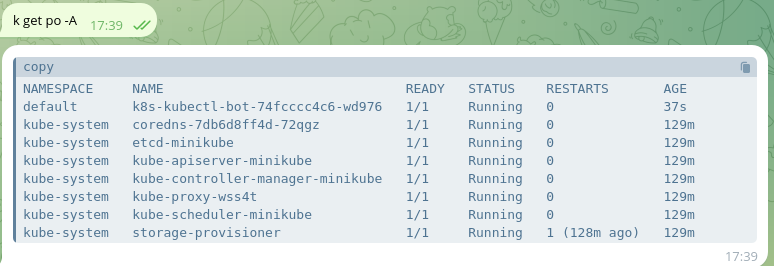

# K8s kubectl bot

This project was born from the simple fact that I was bored and want to write some code in Go that will then be run in a K8s cluster and, why not, also used via Telegram. It has no other purpose than to entertain me for an afternoon.

The first idea I came up with is to use kubectl so the **k8s_kubectl_bot** bot was born (the name kubectl_bot was already taken) and consequently the project is called **k8s-kubectl-bot**.

If you would like to try it too, you will just need to use the cool BotFather to create your bot, and of course, obtain the token. This token must be encoded in base64 format using the command `echo -n <TOKEN> | base64`, and then written into the `secret.yaml` file.

Then you just need to have a k8s cluster (I tried it on minikube) and apply the manifests.

The code is really simple, it takes a request from the user and uses the kubectl binary to write a response (yes I know I could implement a go client and parse the user's request and so on but that was not the purpose). The cluster role gives the bot the possibility to get and list some resources, you can add more.

Example of use:

Perhaps I will also add the ability to use other commands in pipe such as grep and so on.

There is also a funny logo. Enjoy!

